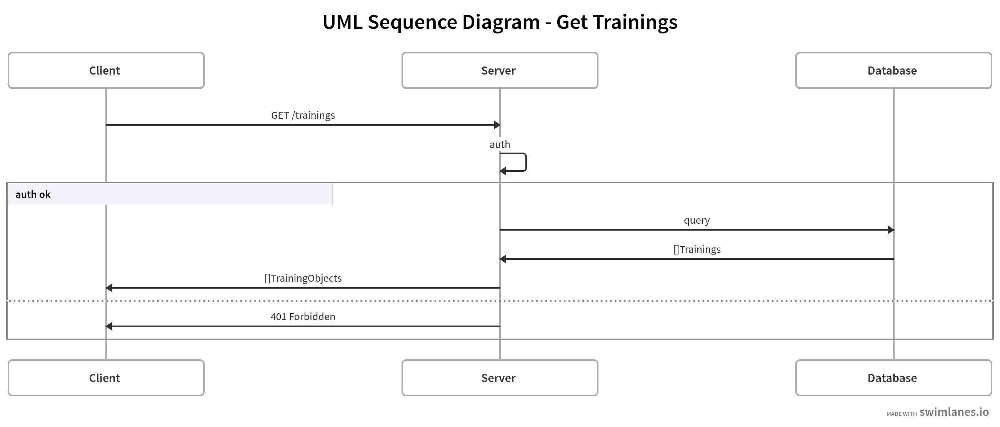

## PROJECT_NAME

- [ADD_TASK_REQUIREMENTS_HERE]
...

[Sophie Lewis](mailto:sophie@codewithdragos.com)

## Assumptions

- [ASSUMPTIONS_MADE_HERE]

## Proposed Solution

*TODO: [ADD_SOLUTION_DESCRIPTION]*
- break down the steps you followed
- use bullet points to explain it in a very structured way

### [Click here to see the Video Review](LINK_TO_LOOM_VIDEO)

## Sequence Diagrams

## Libraries / Tools Used

- Express.js
- Mongoose
- ...

## Setup

To install the dependencies run:

`npm install`

And to run the app:

`npm start`

## Running the tests

You can run the unit tests using:

`npm test`

## Future Work

1. Complete test coverage to achieve 90%
2. Cover the resource not found edge case
3. Run load tests to ensure scalability
...

