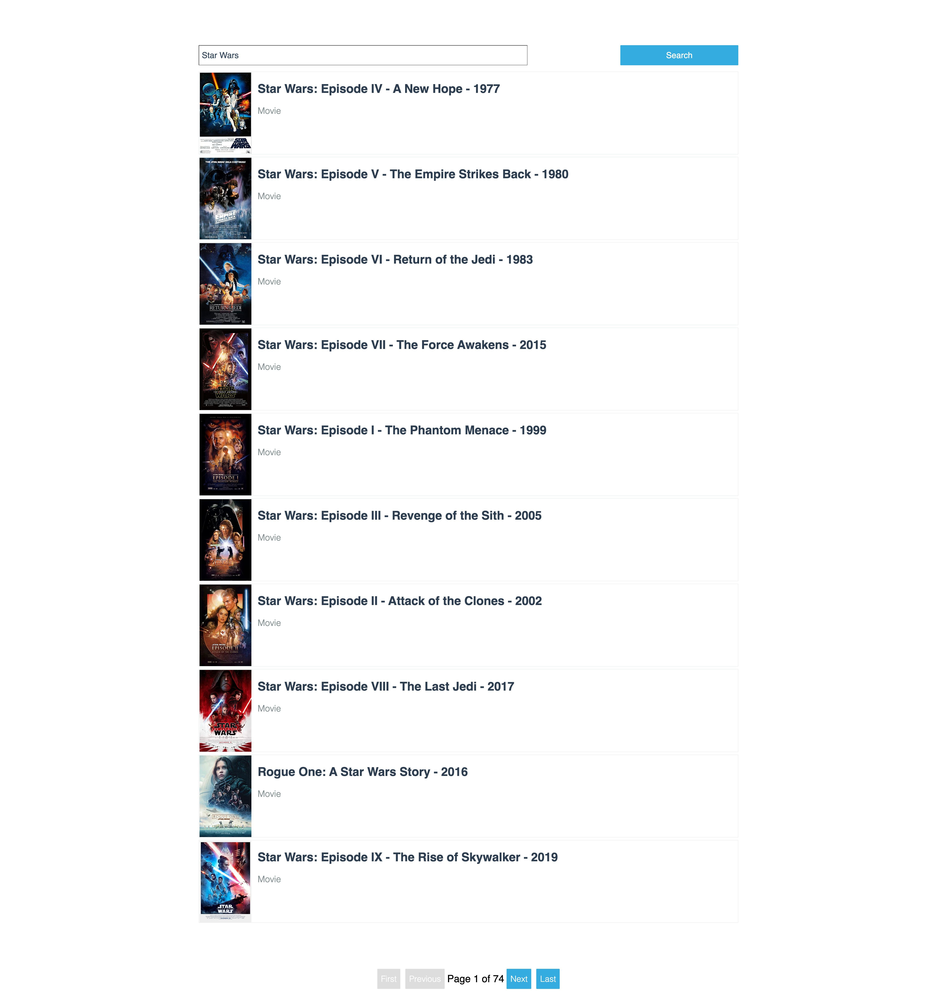

## PROJECT_NAME

*TODO: [ADD_TASK_REQUIREMENTS_HERE]*

[Sophie Lewis](mailto:sophie@codewithdragos.com)

### [Click here to see the Video Review]([LINK_TO_LOOM_VIDEO])

## Assumptions

*TODO: [ASSUMPTIONS_MADE_HERE]*

## Proposed Solution

*TODO: [ADD_SOLUTION_DESCRIPTION]*
- break down the steps you followed
- use bullet points to explain it in a very structured way

### [Click here to see the Live Demo]([LINK_TO_THE_DEPLOYED_APP])

## Screenshots

## Libraries / Tools Used

- React.js
- Create React App for project setup
- ...

## Setup

To install the dependencies run:

`npm install`

And to run the app:

`npm start`

## Running the tests

You can run the unit tests using:

`npm test`

## Future Work

1. Complete test coverage to achieve 90%
2. Improve styling and responsive design
3. Test for perfomance and consider setting up a CDN
...

